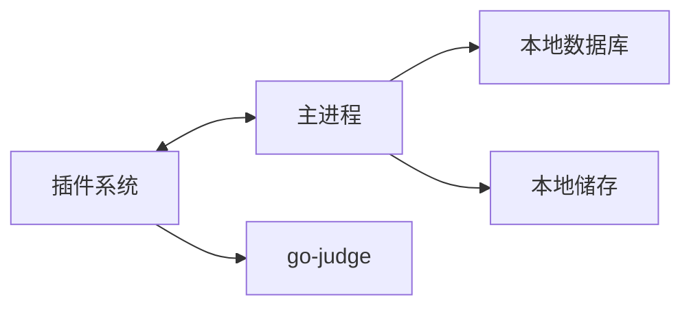
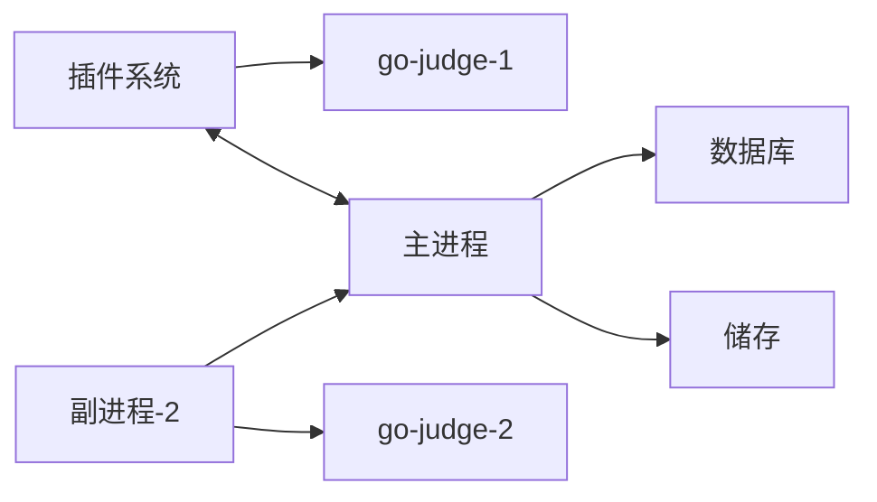

# 系统架构

在线评测系统通常以网页的形式提供服务

- 前端
- 后端
- 任务调度：
  - 池化，分布式，优先级和公平度，可用性和重试，负载均衡
  - 水平扩展
- 数据库
- 消息队列
- 文件存储

### 以 HydroOJ 举个例子

由于 HydroOJ 有内置插件系统，所以会更先进一点。

#### 最精简的架构

如图所示，系统核心组件(即最精简)只有二/三/四个组件：

- 主进程：负责协调，以及提供web服务
- 插件系统：这里单拎出来只是为了理解方便
- go-judge（内置的，可关闭）：副进程以插件形式内置在插件系统中，该sandbox由插件协调，由此可见 HydroOJ 插件系统的强大，特别说明：内置评测机无一般意义上的副进程，而是插件，只需go-judge。
- 本地数据库：MongoDB数据库，储存各种数据
- 本地储存：本地模式下，就是把文件放在一个文件夹里，没有额外软件。似乎只储存题目的测试数据

## 基本模式

如图所示，箭头方向代表网络访问方向，系统组件也就那些：

- 主进程：负责协调，以及提供web服务
- 插件系统：这里单拎出来只是为了理解方便
- go-judge-1（内置的，可关闭）：无一般意义上的副进程，副进程以插件形式内置在主进程中，该 go-judge 由插件协调。
- 数据库：MongoDB 数据库
- 储存：本地模式下，就是把文件放在一个文件夹里，没有额外软件。当然，还有个 S3 模式，可以把各种支持 S3 协议的东西作为储存
- 副进程-2：其实是同一个插件，但是可以独立运行。额外评测机由两个组件构成：副进程-2、go-judge-2
- go-judge-2：有副进程。

不过看完后有没有感到奇怪：为什么是**评测机访问主进程**？

这就是 HydroOJ 的智慧了。

HydroOJ 采用的是被动评测（我自创的“术语”），即是由评测机找主进程领取评测任务，而非主进程分发。

在实际操作中，评测机的副进程通过一个有评测权限的账号到主进程的 web 界面领取任务，然后通过 go-judge 的 API 传递任务，最后通过 go-judge 的 API 获得评测结果并上传到主进程。

这种方式优点多多：

1. 评测机与主进程无需在一个局域网下。也就是说，你的设备能访问主进程的web界面(比如 https://hydro.ac )，就可以作为评测机。这样的话，评测机扩展性非常强，实际操作中甚至可以用脚本实时扩展评测机
2. 评测机无需额外配置。也就是说，装好一台评测机后，无需手动同步数据
